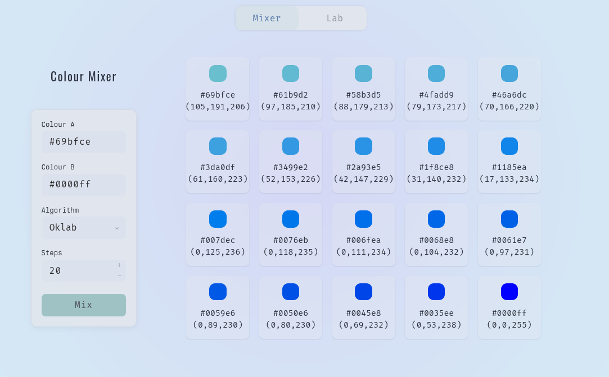

# Colour Mixer

A small web application for exploring how colours transform across perceptual spaces.

Modern UI and graphic systems increasingly treat colour as a perceptual control problem: maintain tone and chroma relationships under constraints, not just pick hex codes. Material Design’s HCT work is a concrete example of this approach.

## Features

- Generate palettes between two colours with selectable interpolation space and method.
- Single-seed tonal ramps using HCT tone scheduling.
- Lab tab: parse a Ghostty theme snippet and emit a deterministic set of CSS variables, including derived ramps and convenience colours.

The `/mix` endpoint supports these algorithms:

- Colorspaces via ColorAide (two-stop A→B):
  - `srgb`, `linear`, `oklab`, `okhsv`, `okhsl`, `hct`, `cam16ucs`, `cam16jmh`

## Run locally

```
uv sync
cd src
uv run -m color_mixer.app
```

Then open:

- `http://127.0.0.1:5000/`

UI notes

- Mixer tab persists selections in sessionStorage.
- Requests are cached client-side via a small LRU to reduce redundant `/mix` calls.
- Lab tab parses Ghostty theme input and emits CSS variables in a stable ordering; derived values are computed by mixing against black/white and selected palette entries.


